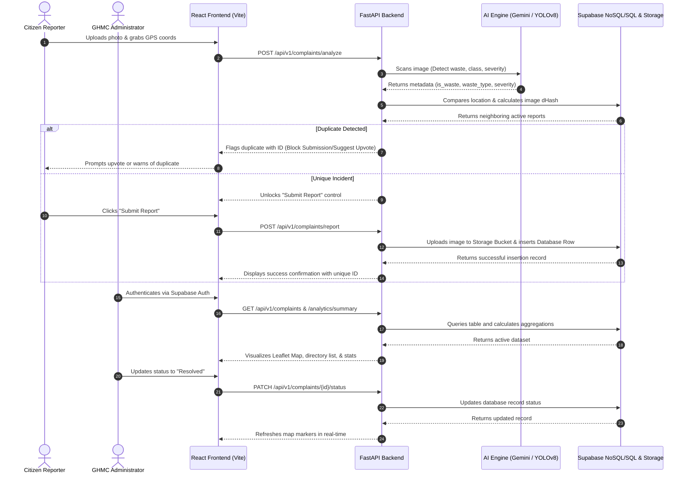

# ♻️ Snap Waste Management System (Hyderabad)

[](https://fastapi.tiangolo.com/)
[](https://react.dev/)
[](https://tailwindcss.com/)
[](https://supabase.com/)
[](https://aistudio.google.com/)
[](https://vercel.com/)

A premium, state-of-the-art public utility reporting and monitoring application designed for the **Greater Hyderabad Municipal Corporation (GHMC)**. The platform enables citizens to report public garbage accumulation with automatic GPS tracking and rich photo uploads. It leverages cutting-edge **Google Gemini Vision AI** (or local **YOLOv8** object detection) to categorize waste types, rate severity, and safeguard against duplication using perceptual hashing (dHash) and spatial coordinate checks.

---

## 🌟 Key Features

### 1. Citizen Incident Reporting Portal
* **Drag-and-Drop / Camera Uploader:** Support for `.jpg`, `.jpeg`, `.png`, and `.webp` uploads.
* **HTML5 Coordinates Locator:** High-fidelity automatic GPS retrieval with an interactive map picker for manual coordinate fine-tuning.
* **Intelligent Image Check:** Automatically runs image analysis to ensure the picture contains garbage. Offers an administrative bypass toggle for edge cases.
* **Status Lookup:** Citizens can query reports using their phone number to check resolution status (`Pending`, `In Progress`, `Resolved`).

### 2. Administrative Command Center
* **Role-Based Command Panel:** Restricted access gateway protected by Supabase Auth.
* **Dual-Pane Operations:** High-contrast Map and Directory view. Clicking on map pins centers detailed reports instantly.
* **Leaflet Interactive Map:** Premium Leaflet dark-mode layout with pulsing pins color-coded by AI-evaluated severity levels.
* **Actionable Controls:** Admins can transition complaint resolution states (`Pending` ➔ `In Progress` ➔ `Resolved`) or permanently delete outdated records.
* **Real-time Analytics Dashboard:** Dynamic counters tracking overall issues, status distribution, waste type charts, and active severity levels.

### 3. Smart De-duplication & AI Safeguards
* **AI Analysis Engines:** Seamlessly switches between the live **Google Gemini Vision AI API** or a local **YOLOv8** model (`yolov8n.pt`).
* **Spatial Coordinate Proximity Check:** Compares newly submitted coordinate pins against active reports within a **50-meter radius**.
* **Perceptual Image Hashing (dHash):** Computes a 64-bit difference hash of uploaded images. Submissions within a **100-meter radius** with a Hamming distance $\le 10$ (~84% image similarity) are automatically flagged as duplicates to prevent double-reporting.
* **Citizen Upvoting & Escalation:** Active complaints can be upvoted by other citizens instead of creating duplicate reports. Upvoting increases the report count and escalates the severity level (e.g., $\ge 3$ reports escalates to High; $\ge 5$ escalates to Critical).

---

## 📐 System Architecture

The workflow below illustrates the citizen reporting lifecycle, de-duplication validation, AI processing, and real-time administrative command updates:



---

## 🛠️ Tech Stack & Key Libraries

### Frontend
* **Core Framework:** [React 19](https://react.dev/) & [Vite](https://vite.dev/)
* **Styling:** [Tailwind CSS v4](https://tailwindcss.com/) & [PostCSS](https://postcss.org/) (Custom Glassmorphism layout)
* **Icons:** [Lucide React](https://lucide.dev/)
* **Mapping:** [Leaflet Maps API](https://leafletjs.com/) (using Leaflet CSS/JS CDNs to support lightweight, wrapper-free rendering)
* **HTTP Client:** [Axios](https://axios-http.com/)

### Backend
* **REST Framework:** [FastAPI](https://fastapi.tiangolo.com/) & [Uvicorn](https://www.uvicorn.org/) (Async python runtime)
* **Configuration:** [Pydantic v2](https://docs.pydantic.dev/) & `pydantic-settings` (Dotenv validation)
* **Database & Auth Integration:** [Supabase Python Client SDK](https://supabase.com/docs/reference/python/introduction)
* **Vision Models:** [Google Generative AI Python SDK](https://aistudio.google.com/) (Gemini Vision) & [Ultralytics YOLOv8](https://docs.ultralytics.com/)
* **Perceptual Hashing & Image Manipulation:** [Pillow (PIL)](https://python-pillow.org/)

---

## 📁 Repository Directory Structure

```text
Snap-Waste-Management/
├── backend/
│   ├── app/
│   │   ├── services/
│   │   │   ├── gemini_service.py     # Gemini Vision API integration
│   │   │   ├── yolo_service.py       # Local YOLOv8 inference pipeline
│   │   │   ├── supabase_service.py   # DB inserts/updates & bucket storage uploads
│   │   │   └── image_hash.py         # 64-bit dHash & Hamming distance helpers
│   │   ├── schemas/
│   │   │   └── models.py             # Pydantic response/request validation schemas
│   │   ├── config.py                 # Pydantic settings configuration loader
│   │   └── main.py                   # FastAPI main route endpoints & static serving
│   ├── requirements.txt              # Backend python package dependencies
│   ├── yolov8n.pt                    # Pre-downloaded YOLOv8 model weights
│   └── .env                          # Backend credentials environment file
│
├── frontend/
│   ├── public/                       # Global static assets
│   ├── src/
│   │   ├── components/
│   │   │   ├── MapViewer.jsx         # Command center dark map rendering
│   │   │   └── StatsCard.jsx         # Analytics counter visualization cards
│   │   ├── pages/
│   │   │   ├── CitizenReport.jsx     # Citizen map-picker, uploader, & lookup
│   │   │   └── AdminDashboard.jsx   # Command center dashboard (authenticated)
│   │   ├── services/
│   │   │   ├── api.js                # Axios route request handles
│   │   │   └── supabaseClient.js     # Supabase browser authentication client
│   │   ├── App.jsx                   # Central layout container and page views
│   │   └── index.css                 # Base stylesheet and theme styles
│   ├── package.json                  # Node package scripts and dependencies
│   └── .env                          # Frontend api-gateway connection configs
│
├── vercel.json                       # Configures Vercel unified multi-service routing
└── README.md                         # Main repository entrypoint (This document)
```

---

## 💾 Supabase Database Schema

Create a table named `complaints` in your Supabase SQL Editor. Enable **Row Level Security (RLS)** as per your project guidelines or configure policies to bypass backend service keys.

```sql
-- Create Complaints table
CREATE TABLE complaints (
    id TEXT PRIMARY KEY,
    "imageUrl" TEXT NOT NULL,
    location JSONB NOT NULL, -- Format: {"latitude": 17.38, "longitude": 78.48}
    address TEXT,
    "wasteType" TEXT NOT NULL,
    "aiAnalysis" JSONB NOT NULL, -- Format: {"severity": "High", "confidence": 0.95, "description": "...", "is_waste": true}
    status TEXT DEFAULT 'Pending' CHECK (status IN ('Pending', 'In Progress', 'Resolved')),
    "reporterPhone" TEXT,
    "reporterNotes" TEXT,
    "reportCount" INT DEFAULT 1,
    "additionalReporters" TEXT[] DEFAULT '{}',
    "imageHash" TEXT,
    "createdAt" TIMESTAMP WITH TIME ZONE DEFAULT timezone('utc'::text, now()),
    "updatedAt" TIMESTAMP WITH TIME ZONE DEFAULT timezone('utc'::text, now())
);

-- Enable Row Level Security (optional - default disabled for backend service keys)
ALTER TABLE complaints ENABLE ROW LEVEL SECURITY;

-- Allow public inserts and selects, restrict edits to authenticated admins
CREATE POLICY "Enable read access for all users" ON complaints FOR SELECT USING (true);
CREATE POLICY "Enable insert access for all users" ON complaints FOR INSERT WITH CHECK (true);
CREATE POLICY "Enable all actions for admins" ON complaints FOR ALL TO authenticated USING (true);
```

### Supabase Storage Bucket Setup
1. Go to your **Supabase Console** -> **Storage**.
2. Click **New Bucket** and name it `waste_images`.
3. Set the bucket privacy toggle to **Public** (so public URLs can be generated).
4. *(Optional)* Add security policies allowing anyone to upload images, but restricting delete permissions to administrators.

---

## ⚡ Setup & Local Development

### 1. Prerequisites
* **Python 3.10+** installed.
* **Node.js v18+** & **npm** installed.
* A [Supabase](https://supabase.com/) Account.
* A [Google AI Studio](https://aistudio.google.com/) Gemini API Key *(Optional - falls back to YOLOv8 or Mock mode).*

---

### 2. Backend Installation (FastAPI)

1. Open your terminal and navigate to the backend folder:
   ```bash
   cd backend
   ```

2. Create and activate a Python virtual environment:
   ```bash
   # Windows:
   python -m venv venv
   venv\Scripts\activate

   # macOS/Linux:
   python3 -m venv venv
   source venv/bin/activate
   ```

3. Install the required dependencies:
   ```bash
   pip install -r requirements.txt
   ```

4. Create a `.env` file inside the `backend` folder:
   ```env
   PORT=8000
   HOST=0.0.0.0

   # AI Configuration ("gemini" or "yolo")
   AI_PROVIDER=gemini
   GEMINI_API_KEY=your_google_gemini_api_key

   # Supabase Configuration
   SUPABASE_URL=https://your-project-id.supabase.co
   SUPABASE_ANON_KEY=your_supabase_anon_key
   SUPABASE_SERVICE_KEY=your_supabase_service_role_key
   ```
   > 💡 **Failsafe Offline Mode:** If Supabase keys are missing or invalid, the backend will automatically spin up in **Mock Mode** using an in-memory store and writing uploads locally or converting them into base64 URLs.

5. Start the FastAPI development server:
   ```bash
   uvicorn app.main:app --reload --port 8000
   ```
   * Swagger Documentation: [http://localhost:8000/docs](http://localhost:8000/docs)
   * Redoc Documentation: [http://localhost:8000/redoc](http://localhost:8000/redoc)

---

### 3. Frontend Installation (React + Vite)

1. Open a new terminal and navigate to the frontend folder:
   ```bash
   cd frontend
   ```

2. Install the node modules:
   ```bash
   npm install
   ```

3. Create a `.env` file in the `frontend` folder:
   ```env
   # API Endpoint (points to the FastAPI server running locally)
   VITE_API_URL=http://localhost:8000

   # Mapbox integration (optional - if omitted, Leaflet falls back to CARTO Voyager tiles)
   VITE_MAPBOX_ACCESS_TOKEN=your_mapbox_access_token_here
   ```

4. Launch the Vite development server:
   ```bash
   npm run dev
   ```
   * Open the local web page: [http://localhost:5173/](http://localhost:5173/)

---

## 🚀 Unified Deployment on Vercel

The application is fully configured for a unified deployment on Vercel using the root-level `vercel.json` file. This lets you run the frontend (React) and backend (FastAPI) under the same custom domain, eliminating CORS challenges.

### How it works (`vercel.json`):
* The frontend Vite project is served on the root route `/`.
* All API endpoints under the `/api` route prefix are directed to the FastAPI gateway `backend/app/main.py`.

### Steps to Deploy:
1. Install Vercel CLI globally:
   ```bash
   npm install -g vercel
   ```
2. Run the deployment command from the repository root:
   ```bash
   vercel
   ```
3. Add your environment variables (`GEMINI_API_KEY`, `SUPABASE_URL`, etc.) under the Project Settings in the Vercel Dashboard.
4. Redeploy to apply variables:
   ```bash
   vercel --prod
   ```

---

## 📜 License

This project is licensed under the MIT License - see the LICENSE file for details. Prepared for the Greater Hyderabad Municipal Corporation (GHMC) Smart City Hackathon.
