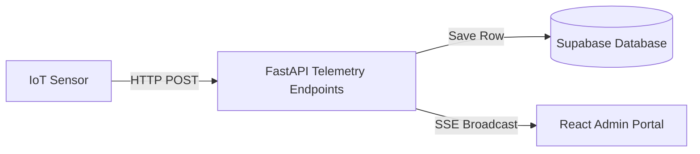

# Implementation Plan: IoT Smart Bin Fullness Monitoring

## 1. Technical Architecture
The IoT sensor telemetry is pushed from smart bin hardware to our FastAPI backend endpoint. The backend validates parameters, saves records into the Supabase database, and notifies active administrative clients via an open Server-Sent Events (SSE) telemetry stream.



## 2. Database Changes
Create a new Supabase table `smart_bins` to track telemetry details:

```sql
CREATE TABLE smart_bins (
    id TEXT PRIMARY KEY,
    location JSONB NOT NULL, -- {"latitude": 17.41, "longitude": 78.43}
    fullness_percentage INT NOT NULL DEFAULT 0,
    battery_percentage INT NOT NULL DEFAULT 100,
    last_reported_at TIMESTAMP WITH TIME ZONE DEFAULT timezone('utc'::text, now())
);
```

## 3. API Changes
Implement a new routing controller `/api/v1/telemetry`:
*   `POST /api/v1/telemetry/report`: Telemetry receiver for IoT devices.
    *   *Payload*: `{"bin_id": "bin_001", "fullness": 82, "battery": 91}`
*   `GET /api/v1/telemetry/stream`: SSE route broadcasting telemetry updates in real-time.

## 4. Frontend Changes
*   **Leaflet Integration**: Add custom pulsing Leaflet icons representing smart bins on the Map dashboard.
*   **Fullness Card**: Add a list rendering bins in descending order of fullness, highlighting priority collection targets in red.
